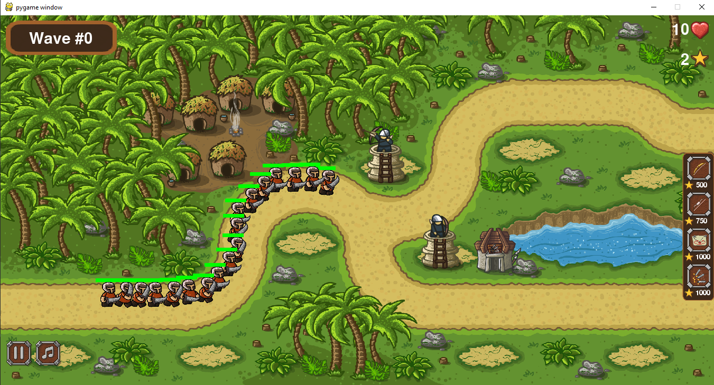
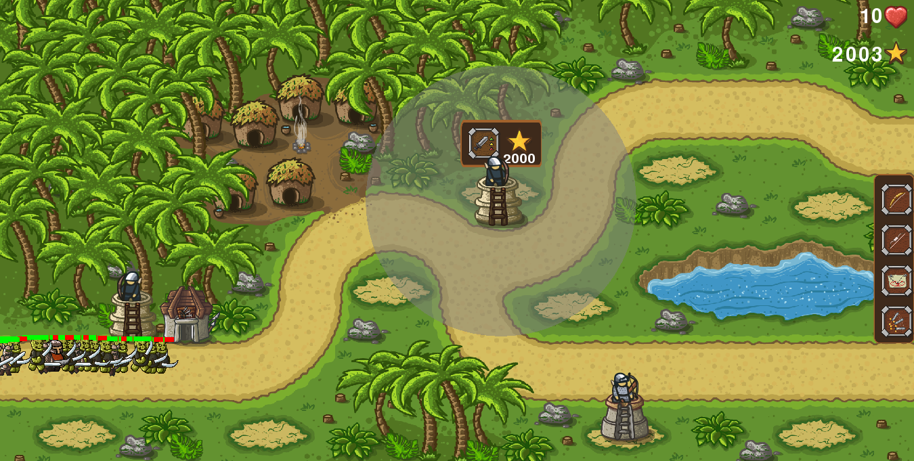

# Attack_game

Attack_game is a tower defense video game.
Tower defense (Attack) is a subgenre of strategy video game where the goal is to defend a player's territories or possessions by obstructing the enemy attackers, usually achieved by placing defensive structures on or along their path of attack This typically means building a variety of different structures that serve to automatically block, impede, attack or destroy enemies. 
